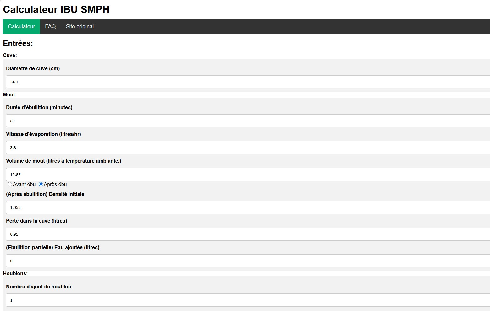

# SMPH IBU Calculator

A web app to calculate IBUs (International Bitterness Units) using the SMPH model, translated and adapted from [jphosom's AlchemyOverlord](https://jphosom.github.io/alchemyoverlord/ibu_SMPH.html).

Live at: **https://smph.gcourtot.fr**

## Why

While using my Grainfather app to prepare my recipe, I noticed that late hop additions were not accounted for in the IBU estimation. Asking around I found out about the SMPH method and decided I could make it a web app.

<p align="center">
  
</p>

## What it does

- Calculates IBUs using the SMPH model
- Handles kettle, wort, hop, fermentation and conditioning parameters
- Supports whirlpool / hop stand additions
- Supports forced cooling methods (immersion chiller, counterflow, ice bath)
- Save and load parameters to/from a local file

## Stack

| Component   | Technology |
|-------------|------------|
| Frontend    | HTML / CSS / Vanilla JavaScript |
| Server      | Apache HTTPd (Docker image `httpd:alpine3.21`) |
| CI/CD       | GitHub Actions |
| Registry    | Docker Hub |
| Deployment  | n8n (webhook → Watchtower) |

## Run locally

```bash
docker build -t smph .
docker run -d -p 8080:80 smph
# Open http://localhost:8080
```

## CI/CD

### Pull Request → `main`

1. Build the Docker image
2. Start the container
3. Verify that `/version.txt` contains the correct commit SHA

### Push to `main`

1. Tag the current `latest` image as `previous` (for rollback)
2. Build and push the new `latest` image to Docker Hub
3. Trigger deployment via n8n webhook
4. Verify in production that `/version.txt` matches the expected SHA
5. **Automatic rollback** if the production check fails: `previous` is re-tagged as `latest` and redeployed

### Required secrets

| Secret | Description |
|--------|-------------|
| `DOCKERHUB_USERNAME` | Docker Hub username |
| `DOCKERHUB_TOKEN`    | Docker Hub access token |
| `N8N_WEBHOOK_ID`     | n8n webhook ID triggering the redeployment |

